# Accesses API call flows for B2B and B2B2C usages.

## General aspects on 2-legged and 3-legged token usages

There are a number considerations when using 3-legged access tokens for the API access. In general, the subject is identified from the access token and not provided within the API body. Information encapsulated in the access token (i.e. info about the subject) is not disclosed to the API consumer. 

* The API consumer must decide on a 2-legged or 3-legged token usage. The API consumer should do this based on the relation to the targeted device. The "relation" means here, that the Network Provider is aware, that the API consumer and the device owner are in the same organization (i.e. have a relation) and that the Network Provider allows a 2-legged token usage for the given device(s).  
  * When there is no relation (i.e. device does not belong to the same organization as the API Consumer), a 3-legged token is used. This is a B2C or a B2B2C scenario.
  * When the device belongs to the same organization as the API Consumer, the Network Provider should be aware about the relation. In this case, a 2-legged token can be used. Note, the Network provider may always verify the relation of the API consumer and the device owner. This is a B2B scenario.
  * When the needed operation does not target a device, the API consumer can use a 2-legged access token. For example, when the API consumer uses the `areas` or the `networks` API, the operation never requires a device identifier.

* When a 3-legged token is used, the response must not contain any `device` object — device-identifying information provided via the token must not be disclosed.
* 3-legged tokens can only be used for targeting one device at a time.
* Operations that reference devices by an opaque, server-generated (resource) identifier can use a 2-legged token, even in B2B2C scenarios, because the identifier does not disclose device-identifying information. Such a resource must have been previously created using a 3-legged token by the same API consumer.
* When a device specific resource has been created using 3-legged access tokens, the `device` object must not be present in any notification.

## (A1) Create an access (Intentionally) without devices

Since no device is addressed, a **2-legged access token** (client credentials) is sufficient. An empty access (no devices) is created. 

Note, this case becomes an A2b case, when a 3-legged token is used. 

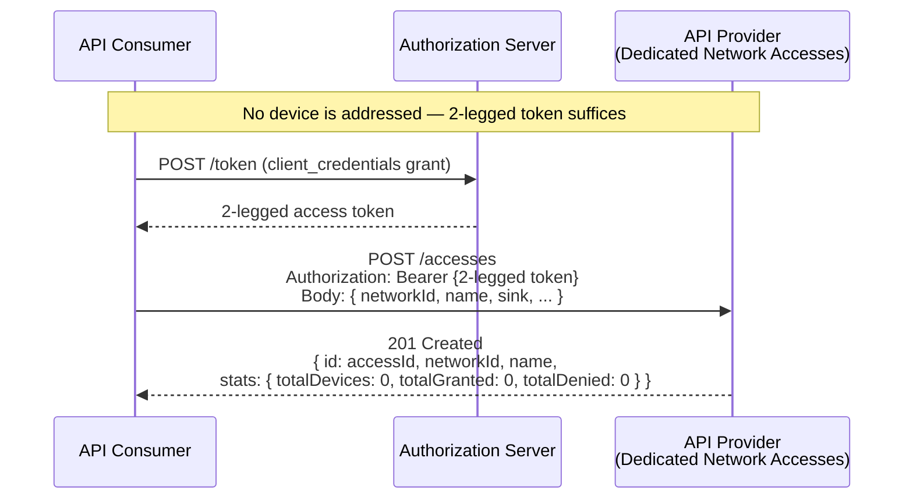
```mermaid
sequenceDiagram
    participant C as API Consumer
    participant Auth as Authorization Server
    participant API as API Provider<br/>(Dedicated Network Accesses)

    Note over C,API: No device is addressed — 2-legged token suffices

    C->>Auth: POST /token (client_credentials grant)
    Auth-->>C: 2-legged access token

    C->>API: POST /accesses<br/>Authorization: Bearer {2-legged token}<br/>Body: { networkId, name, sink, ... }
    API-->>C: 201 Created<br/>{ id: accessId, networkId, name,<br/>  stats: { totalDevices: 0, totalGranted: 0, totalDenied: 0 } }
```

## (A2) Create an access with devices

### (A2a) With 2-legged access token — devices are in the request body (B2B)

The API consumer creates the access and provides one or more devices explicitly in the `devices` array.

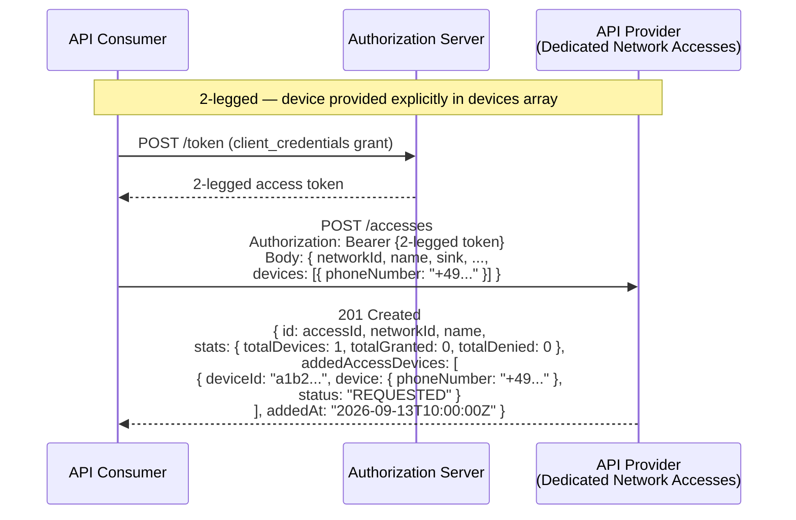
```mermaid
sequenceDiagram
    participant C as API Consumer
    participant Auth as Authorization Server
    participant API as API Provider<br/>(Dedicated Network Accesses)

    Note over C,API: 2-legged — device provided explicitly in devices array

    C->>Auth: POST /token (client_credentials grant)
    Auth-->>C: 2-legged access token

    C->>API: POST /accesses<br/>Authorization: Bearer {2-legged token}<br/>Body: { networkId, name, sink, ...,<br/>  devices: [{ phoneNumber: "+49..." }] }
    API-->>C: 201 Created<br/>{ id: accessId, networkId, name,<br/>  stats: { totalDevices: 1, totalGranted: 0, totalDenied: 0 },<br/>  addedAccessDevices: [<br/>    { deviceId: "a1b2...", device: { phoneNumber: "+49..." },<br/>      status: "REQUESTED" }<br/>  ], addedAt: "2026-09-13T10:00:00Z" }
```

TBD: Error Cases

### (A2b) With 3-legged access token — one device identified from token (B2B2C)

The API consumer creates the access with a 3-legged token. The `devices` array MUST NOT be provided — the single device is identified from the token.

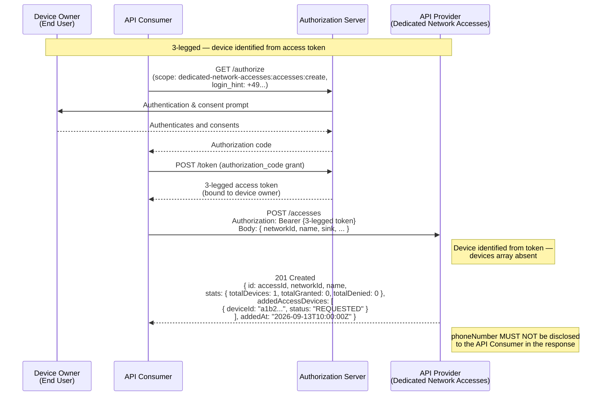
```mermaid
sequenceDiagram
    participant U as Device Owner<br/>(End User)
    participant C as API Consumer
    participant Auth as Authorization Server
    participant API as API Provider<br/>(Dedicated Network Accesses)

    Note over U,API: 3-legged — device identified from access token

    C->>Auth: GET /authorize<br/>(scope: dedicated-network-accesses:accesses:create,<br/> login_hint: +49...)
    Auth->>U: Authentication & consent prompt
    U-->>Auth: Authenticates and consents
    Auth-->>C: Authorization code

    C->>Auth: POST /token (authorization_code grant)
    Auth-->>C: 3-legged access token<br/>(bound to device owner)

    C->>API: POST /accesses<br/>Authorization: Bearer {3-legged token}<br/>Body: { networkId, name, sink, ... }
    Note right of API: Device identified from token —<br/>devices array absent
    API-->>C: 201 Created<br/>{ id: accessId, networkId, name,<br/>  stats: { totalDevices: 1, totalGranted: 0, totalDenied: 0 },<br/>  addedAccessDevices: [<br/>    { deviceId: "a1b2...", status: "REQUESTED" }<br/>  ], addedAt: "2026-09-13T10:00:00Z" }
    Note right of API: phoneNumber MUST NOT be disclosed<br/>to the API Consumer in the response
```

TBD: Error Cases

## (B) Add one or more devices to an existing access

### (B1) With 2-legged access token — one or more devices in request body (B2B)

The API consumer identifies the devices explicitly via the `devices` array. No end-user interaction is needed.

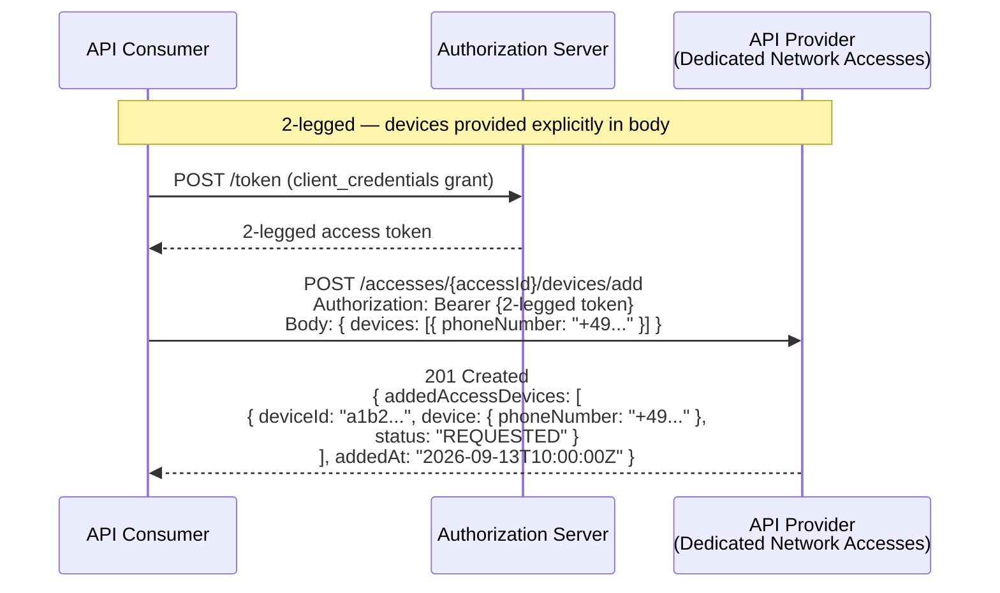
```mermaid
sequenceDiagram
    participant C as API Consumer
    participant Auth as Authorization Server
    participant API as API Provider<br/>(Dedicated Network Accesses)

    Note over C,API: 2-legged — devices provided explicitly in body

    C->>Auth: POST /token (client_credentials grant)
    Auth-->>C: 2-legged access token

    C->>API: POST /accesses/{accessId}/devices/add<br/>Authorization: Bearer {2-legged token}<br/>Body: { devices: [{ phoneNumber: "+49..." }] }
    API-->>C: 201 Created<br/>{ addedAccessDevices: [<br/>    { deviceId: "a1b2...", device: { phoneNumber: "+49..." },<br/>      status: "REQUESTED" }<br/>  ], addedAt: "2026-09-13T10:00:00Z" }
```

TBD: Error Cases

### (B2) With 3-legged access token — one device identified from token (B2B2C)

The API consumer MUST NOT include the `devices` array — the single device is identified from the token.

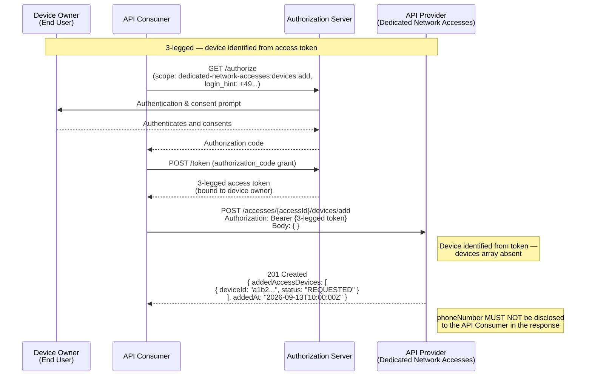
```mermaid
sequenceDiagram
    participant U as Device Owner<br/>(End User)
    participant C as API Consumer
    participant Auth as Authorization Server
    participant API as API Provider<br/>(Dedicated Network Accesses)

    Note over U,API: 3-legged — device identified from access token

    C->>Auth: GET /authorize<br/>(scope: dedicated-network-accesses:devices:add,<br/> login_hint: +49...)
    Auth->>U: Authentication & consent prompt
    U-->>Auth: Authenticates and consents
    Auth-->>C: Authorization code

    C->>Auth: POST /token (authorization_code grant)
    Auth-->>C: 3-legged access token<br/>(bound to device owner)

    C->>API: POST /accesses/{accessId}/devices/add<br/>Authorization: Bearer {3-legged token}<br/>Body: { }
    Note right of API: Device identified from token —<br/>devices array absent
    API-->>C: 201 Created<br/>{ addedAccessDevices: [<br/>    { deviceId: "a1b2...", status: "REQUESTED" }<br/>  ], addedAt: "2026-09-13T10:00:00Z" }
    Note right of API: phoneNumber MUST NOT be disclosed<br/>to the API Consumer in the response
```

### Error cases

1. 3-legged token + devices array present
2. 2-legged token + devices array absent

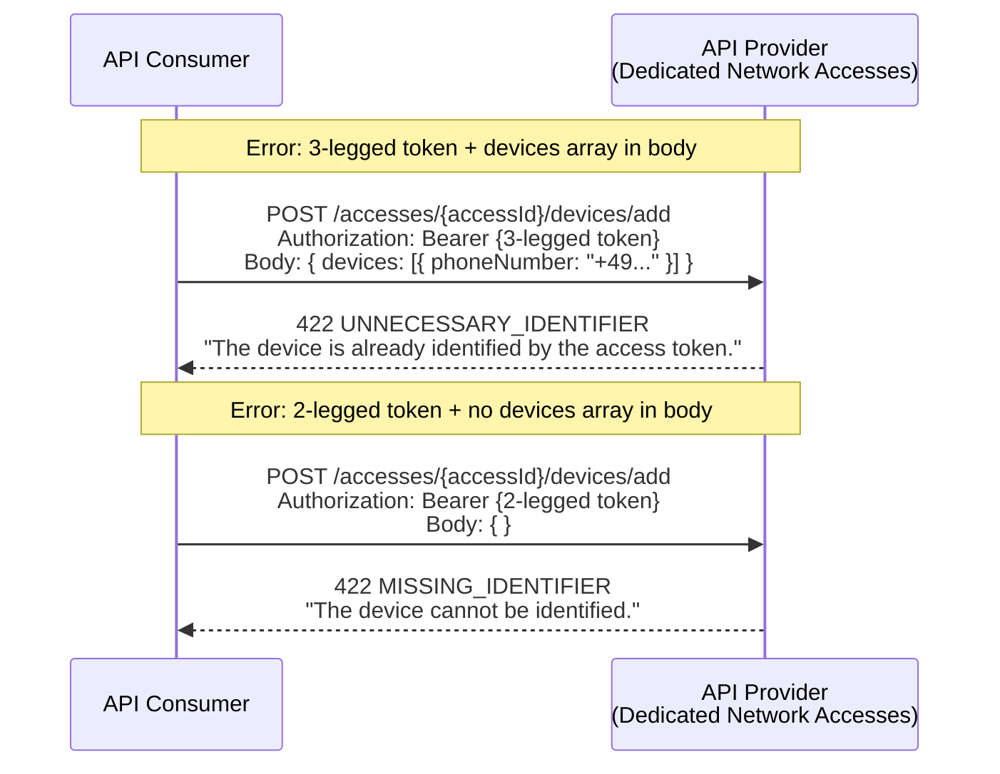
```mermaid
sequenceDiagram
    participant C as API Consumer
    participant API as API Provider<br/>(Dedicated Network Accesses)

    Note over C,API: Error: 3-legged token + devices array in body

    C->>API: POST /accesses/{accessId}/devices/add<br/>Authorization: Bearer {3-legged token}<br/>Body: { devices: [{ phoneNumber: "+49..." }] }
    API-->>C: 422 UNNECESSARY_IDENTIFIER<br/>"The device is already identified by the access token."

    Note over C,API: Error: 2-legged token + no devices array in body

    C->>API: POST /accesses/{accessId}/devices/add<br/>Authorization: Bearer {2-legged token}<br/>Body: { }
    API-->>C: 422 MISSING_IDENTIFIER<br/>"The device cannot be identified."
```

## (C) Delete an individual device from an access

The device is addressed by its opaque `accessDeviceId` (obtained when the device was added), not by a device identifier. No device object appears in the request, so the "device from token" rules do not apply.

Question: Is it an error, when a 3-legged access token is used?

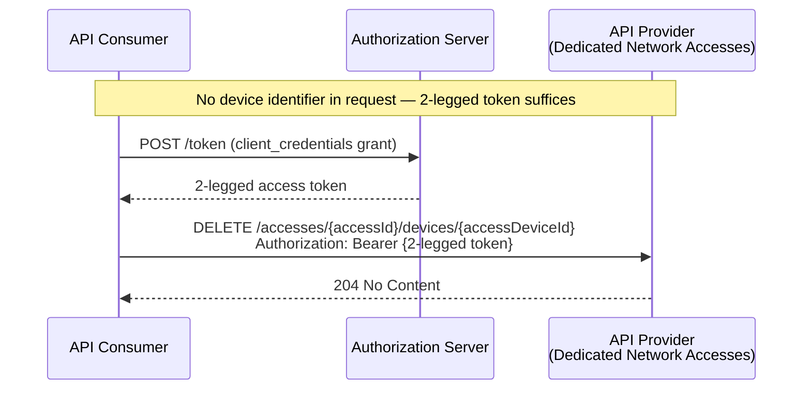
```mermaid
sequenceDiagram
    participant C as API Consumer
    participant Auth as Authorization Server
    participant API as API Provider<br/>(Dedicated Network Accesses)

    Note over C,API: No device identifier in request — 2-legged token suffices

    C->>Auth: POST /token (client_credentials grant)
    Auth-->>C: 2-legged access token

    C->>API: DELETE /accesses/{accessId}/devices/{accessDeviceId}<br/>Authorization: Bearer {2-legged token}
    API-->>C: 204 No Content
```

tbd: Error cases

## (D) Remove one or more devices from an access

The devices are addressed by their opaque `accessDeviceId` (obtained when the device was added), not by a device identifier. No device object appears in the request, so the "device from token" rules do not apply. 

Question: Is it an error, when a 3-legged access token is used?

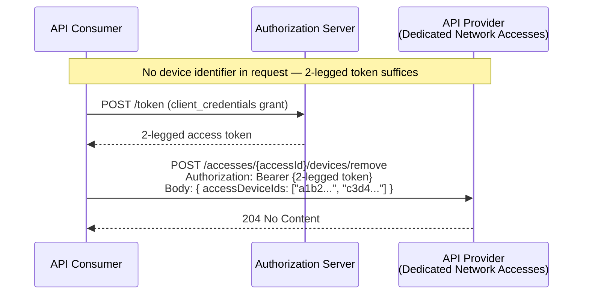
```mermaid
sequenceDiagram
    participant C as API Consumer
    participant Auth as Authorization Server
    participant API as API Provider<br/>(Dedicated Network Accesses)

    Note over C,API: No device identifier in request — 2-legged token suffices

    C->>Auth: POST /token (client_credentials grant)
    Auth-->>C: 2-legged access token

    C->>API: POST /accesses/{accessId}/devices/remove<br/>Authorization: Bearer {2-legged token}<br/>Body: { accessDeviceIds: ["a1b2...", "c3d4..."] }
    API-->>C: 204 No Content
```

### Error case — partial success

If some devices could not be removed (e.g. not found), the API returns `207` with error details for the failed devices. Successfully removed devices are not listed.

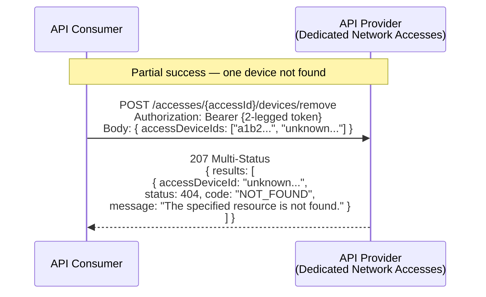
```mermaid
sequenceDiagram
    participant C as API Consumer
    participant API as API Provider<br/>(Dedicated Network Accesses)

    Note over C,API: Partial success — one device not found

    C->>API: POST /accesses/{accessId}/devices/remove<br/>Authorization: Bearer {2-legged token}<br/>Body: { accessDeviceIds: ["a1b2...", "unknown..."] }
    API-->>C: 207 Multi-Status<br/>{ results: [<br/>    { accessDeviceId: "unknown...",<br/>      status: 404, code: "NOT_FOUND",<br/>      message: "The specified resource is not found." }<br/>  ] }
```

## (E) List devices in an access

`GET /accesses/{accessId}/devices` returns a paged list of devices included in the access, optionally filtered by status (`deviceStatus`) and/or by when the device was added (`addedAt.gte`, `addedAt.gt`, `addedAt.lte`, `addedAt.lt`). No device identifier is sent in the request, so the "device from token" rules do not apply. However, the `device` object in the response (showing the `phoneNumber`) may only appear in B2B cases.

Thus:
* B2B case: 2-legged token and the `device` object (`phoneNumber`) may appear in the response
* B2B2C case: 2-legged token and the `device` object (`phoneNumber`) must not appear in the response
* It should be an error case, when a 3-legged access token is used for B2B2C.

### (E1a) List all devices (B2B)

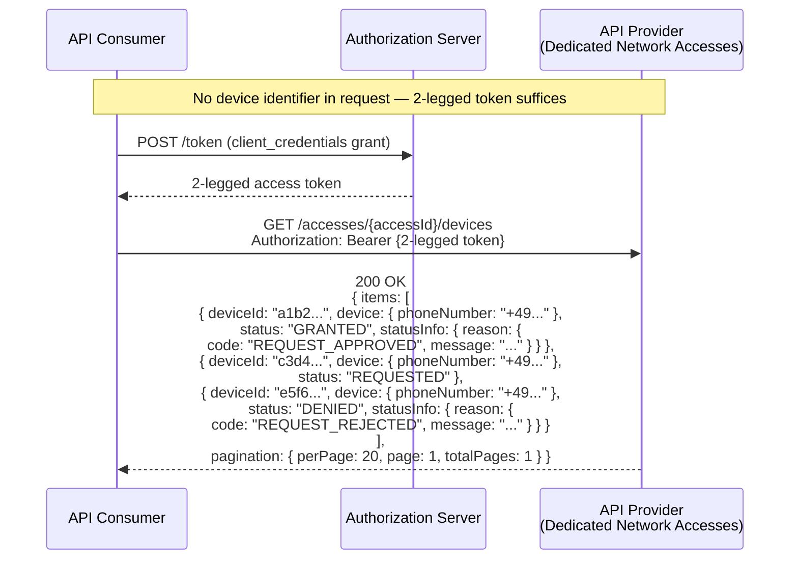
```mermaid
sequenceDiagram
    participant C as API Consumer
    participant Auth as Authorization Server
    participant API as API Provider<br/>(Dedicated Network Accesses)

    Note over C,API: No device identifier in request — 2-legged token suffices

    C->>Auth: POST /token (client_credentials grant)
    Auth-->>C: 2-legged access token

    C->>API: GET /accesses/{accessId}/devices<br/>Authorization: Bearer {2-legged token}
    API-->>C: 200 OK<br/>{ items: [<br/>    { deviceId: "a1b2...", device: { phoneNumber: "+49..." },<br/>      status: "GRANTED", statusInfo: { reason: {<br/>        code: "REQUEST_APPROVED", message: "..." } } },<br/>    { deviceId: "c3d4...", device: { phoneNumber: "+49..." },<br/>      status: "REQUESTED" },<br/>    { deviceId: "e5f6...", device: { phoneNumber: "+49..." },<br/>      status: "DENIED", statusInfo: { reason: {<br/>        code: "REQUEST_REJECTED", message: "..." } } }<br/>  ],<br/>  pagination: { perPage: 20, page: 1, totalPages: 1 } }
```
### (E1b) List all devices (B2B2C)

Same as E1a, but the `device` object must not appear in the response — phone numbers must not be disclosed to the API consumer. The `accessDevice` has been created using a 3-legged token. 

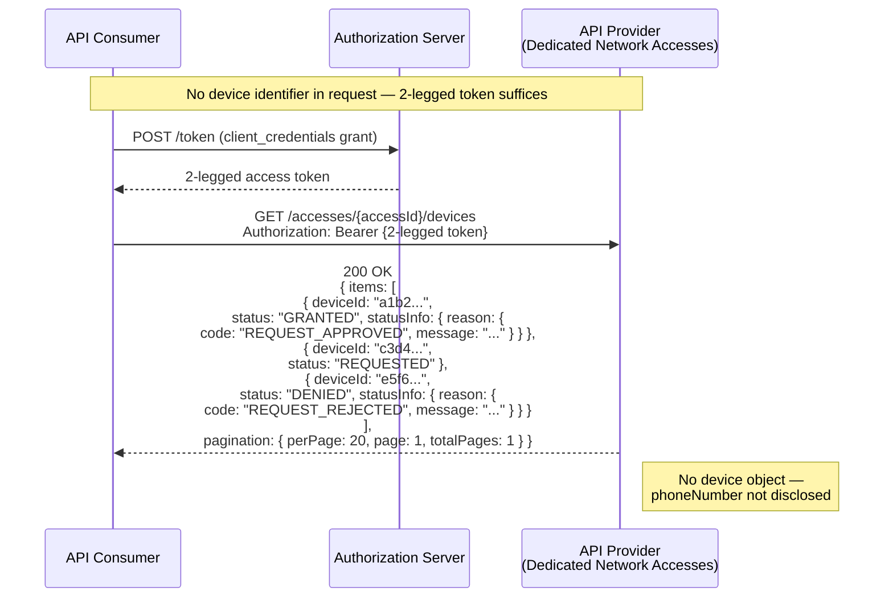
```mermaid
sequenceDiagram
    participant C as API Consumer
    participant Auth as Authorization Server
    participant API as API Provider<br/>(Dedicated Network Accesses)

    Note over C,API: No device identifier in request — 2-legged token suffices

    C->>Auth: POST /token (client_credentials grant)
    Auth-->>C: 2-legged access token

    C->>API: GET /accesses/{accessId}/devices<br/>Authorization: Bearer {2-legged token}
    API-->>C: 200 OK<br/>{ items: [<br/>    { deviceId: "a1b2...",<br/>      status: "GRANTED", statusInfo: { reason: {<br/>        code: "REQUEST_APPROVED", message: "..." } } },<br/>    { deviceId: "c3d4...",<br/>      status: "REQUESTED" },<br/>    { deviceId: "e5f6...",<br/>      status: "DENIED", statusInfo: { reason: {<br/>        code: "REQUEST_REJECTED", message: "..." } } }<br/>  ],<br/>  pagination: { perPage: 20, page: 1, totalPages: 1 } }
    Note right of API: No device object —<br/>phoneNumber not disclosed
```

### (E2) List only GRANTED devices added after a certain time

Combines `deviceStatus` and `addedAt.gte` filters to retrieve devices that were recently added and have already been granted access.

### (E2a) Filtered list (B2B)

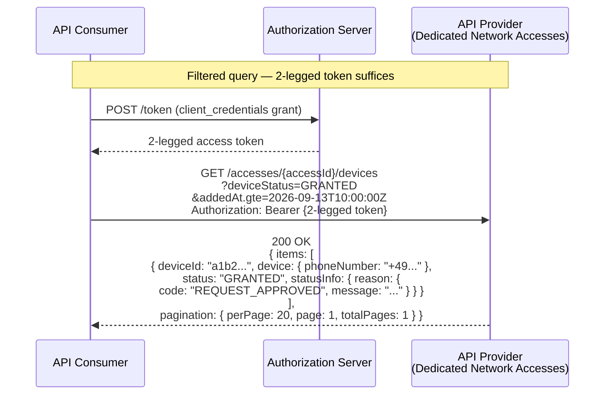
```mermaid
sequenceDiagram
    participant C as API Consumer
    participant Auth as Authorization Server
    participant API as API Provider<br/>(Dedicated Network Accesses)

    Note over C,API: Filtered query — 2-legged token suffices

    C->>Auth: POST /token (client_credentials grant)
    Auth-->>C: 2-legged access token

    C->>API: GET /accesses/{accessId}/devices<br/>?deviceStatus=GRANTED<br/>&addedAt.gte=2026-09-13T10:00:00Z<br/>Authorization: Bearer {2-legged token}
    API-->>C: 200 OK<br/>{ items: [<br/>    { deviceId: "a1b2...", device: { phoneNumber: "+49..." },<br/>      status: "GRANTED", statusInfo: { reason: {<br/>        code: "REQUEST_APPROVED", message: "..." } } }<br/>  ],<br/>  pagination: { perPage: 20, page: 1, totalPages: 1 } }
```

### (E2b) Filtered list (B2B2C)

Same filters as E2a, but the `device` object must not appear in the response — phone numbers must not be disclosed to the API consumer. The filtered `accessDevice`s have been created using a 3-legged token.

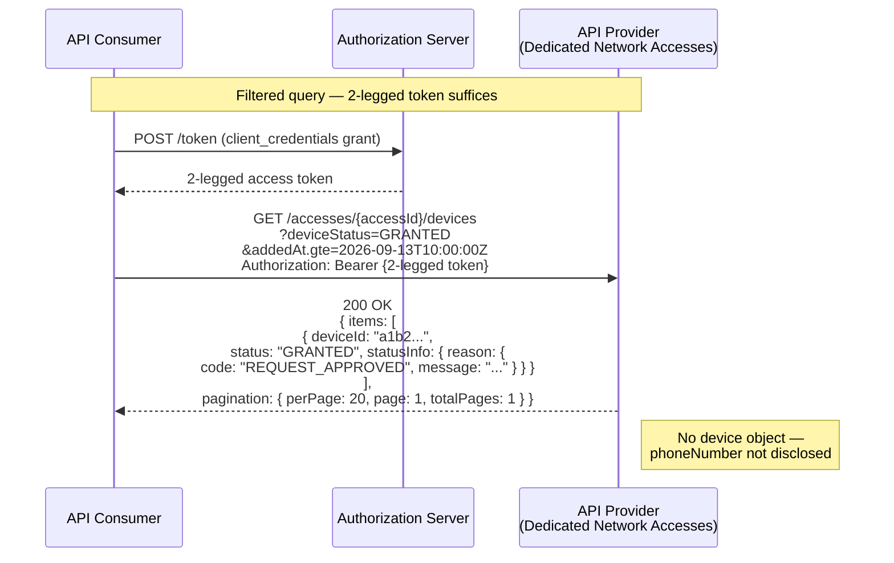
```mermaid
sequenceDiagram
    participant C as API Consumer
    participant Auth as Authorization Server
    participant API as API Provider<br/>(Dedicated Network Accesses)

    Note over C,API: Filtered query — 2-legged token suffices

    C->>Auth: POST /token (client_credentials grant)
    Auth-->>C: 2-legged access token

    C->>API: GET /accesses/{accessId}/devices<br/>?deviceStatus=GRANTED<br/>&addedAt.gte=2026-09-13T10:00:00Z<br/>Authorization: Bearer {2-legged token}
    API-->>C: 200 OK<br/>{ items: [<br/>    { deviceId: "a1b2...",<br/>      status: "GRANTED", statusInfo: { reason: {<br/>        code: "REQUEST_APPROVED", message: "..." } } }<br/>  ],<br/>  pagination: { perPage: 20, page: 1, totalPages: 1 } }
    Note right of API: No device object —<br/>phoneNumber not disclosed
```

## (F) Notifications — device status changes

When an access is created with `sink` (and optionally `sinkCredential`), the API provider sends `DEVICE_STATUS_CHANGED` CloudEvents to the API consumer's callback endpoint whenever a device's status transitions. The typical transitions are:

- **REQUESTED → GRANTED** — the CSP approved the device for network access (reason code `REQUEST_APPROVED`)
- **REQUESTED → DENIED** — the CSP rejected the request (reason code `REQUEST_REJECTED` or `REQUEST_FAILED`)
- **GRANTED → DENIED** — the CSP revoked a previously granted access (reason code `ACCESS_REVOKED` or `ACCESS_FAILED`)

Notifications are sent by the API provider (server-initiated), so no access token is used by the API consumer to receive them. The API consumer implements the callback endpoint.

The content of the notification depends on how the device was originally added:

- **2-legged (B2B):** The device was added with an explicit `device` object in the request body, so the API provider includes the `device` object in the notification. The API consumer already knows the device identity.
- **3-legged (B2B2C):** The device was identified from the access token and no `device` object was provided. The `device` object MUST NOT be disclosed in the notification — only the opaque `deviceId` (and `status`/`statusInfo`) is present.

### (F1a) REQUESTED → GRANTED — 2-legged (B2B, device object present)

After a device is added (via `POST /accesses` or `POST .../devices/add`), the API provider evaluates whether the device can access the network. On approval, a notification is sent to the registered sink.

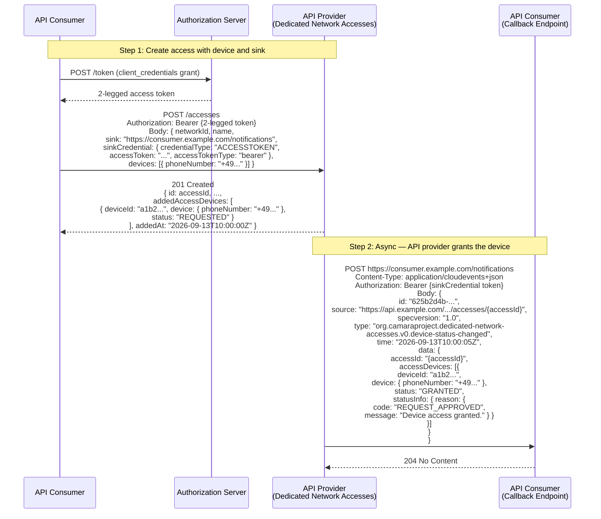
```mermaid
sequenceDiagram
    participant C as API Consumer
    participant Auth as Authorization Server
    participant API as API Provider<br/>(Dedicated Network Accesses)
    participant CB as API Consumer<br/>(Callback Endpoint)

    Note over C,API: Step 1: Create access with device and sink

    C->>Auth: POST /token (client_credentials grant)
    Auth-->>C: 2-legged access token

    C->>API: POST /accesses<br/>Authorization: Bearer {2-legged token}<br/>Body: { networkId, name,<br/>  sink: "https://consumer.example.com/notifications",<br/>  sinkCredential: { credentialType: "ACCESSTOKEN",<br/>    accessToken: "...", accessTokenType: "bearer" },<br/>  devices: [{ phoneNumber: "+49..." }] }
    API-->>C: 201 Created<br/>{ id: accessId, ...,<br/>  addedAccessDevices: [<br/>    { deviceId: "a1b2...", device: { phoneNumber: "+49..." },<br/>      status: "REQUESTED" }<br/>  ], addedAt: "2026-09-13T10:00:00Z" }

    Note over API,CB: Step 2: Async — API provider grants the device

    API->>CB: POST https://consumer.example.com/notifications<br/>Content-Type: application/cloudevents+json<br/>Authorization: Bearer {sinkCredential token}<br/>Body: {<br/>  id: "625b2d4b-...",<br/>  source: "https://api.example.com/.../accesses/{accessId}",<br/>  specversion: "1.0",<br/>  type: "org.camaraproject.dedicated-network-<br/>    accesses.v0.device-status-changed",<br/>  time: "2026-09-13T10:00:05Z",<br/>  data: {<br/>    accessId: "{accessId}",<br/>    accessDevices: [{<br/>      deviceId: "a1b2...",<br/>      device: { phoneNumber: "+49..." },<br/>      status: "GRANTED",<br/>      statusInfo: { reason: {<br/>        code: "REQUEST_APPROVED",<br/>        message: "Device access granted." } }<br/>    }]<br/>  }<br/>}
    CB-->>API: 204 No Content
```

### (F1b) REQUESTED → DENIED — 2-legged (B2B, device object present)

If the CSP cannot grant the device access (e.g. insufficient resources, incompatible device), a notification with status `DENIED` is sent.

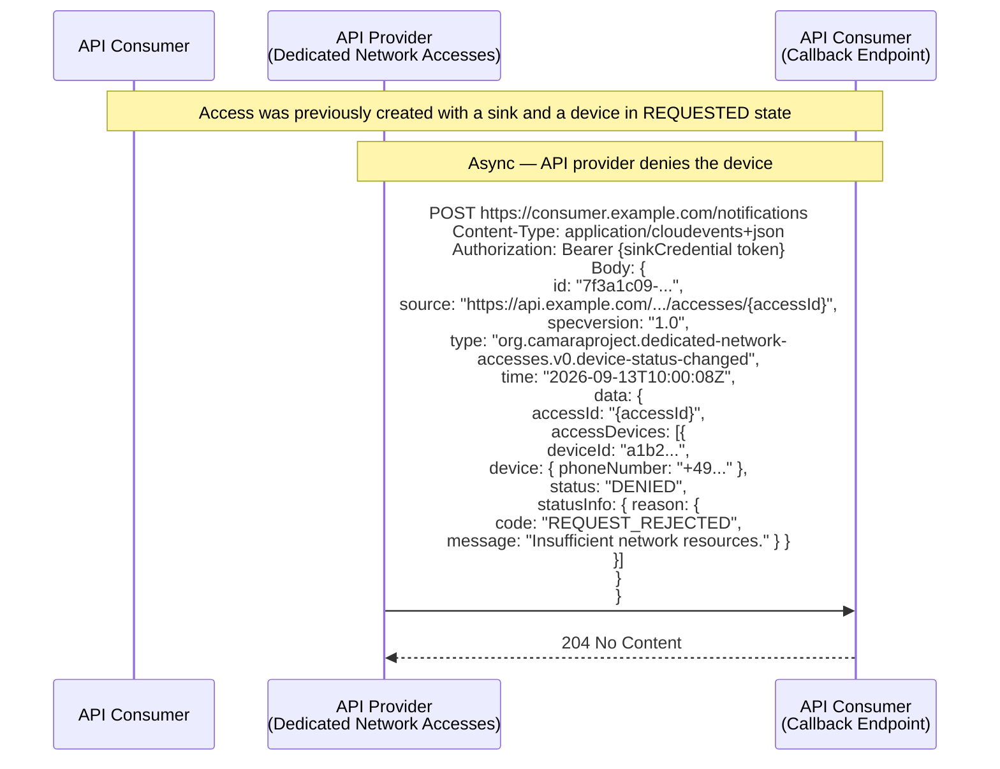
```mermaid
sequenceDiagram
    participant C as API Consumer
    participant API as API Provider<br/>(Dedicated Network Accesses)
    participant CB as API Consumer<br/>(Callback Endpoint)

    Note over C,CB: Access was previously created with a sink and a device in REQUESTED state

    Note over API,CB: Async — API provider denies the device

    API->>CB: POST https://consumer.example.com/notifications<br/>Content-Type: application/cloudevents+json<br/>Authorization: Bearer {sinkCredential token}<br/>Body: {<br/>  id: "7f3a1c09-...",<br/>  source: "https://api.example.com/.../accesses/{accessId}",<br/>  specversion: "1.0",<br/>  type: "org.camaraproject.dedicated-network-<br/>    accesses.v0.device-status-changed",<br/>  time: "2026-09-13T10:00:08Z",<br/>  data: {<br/>    accessId: "{accessId}",<br/>    accessDevices: [{<br/>      deviceId: "a1b2...",<br/>      device: { phoneNumber: "+49..." },<br/>      status: "DENIED",<br/>      statusInfo: { reason: {<br/>        code: "REQUEST_REJECTED",<br/>        message: "Insufficient network resources." } }<br/>    }]<br/>  }<br/>}
    CB-->>API: 204 No Content
```

### (F1c) GRANTED → DENIED (revocation) — 2-legged (B2B, device object present)

A device that was previously granted access may have its access revoked by the CSP at any time (e.g. network failure, policy change).

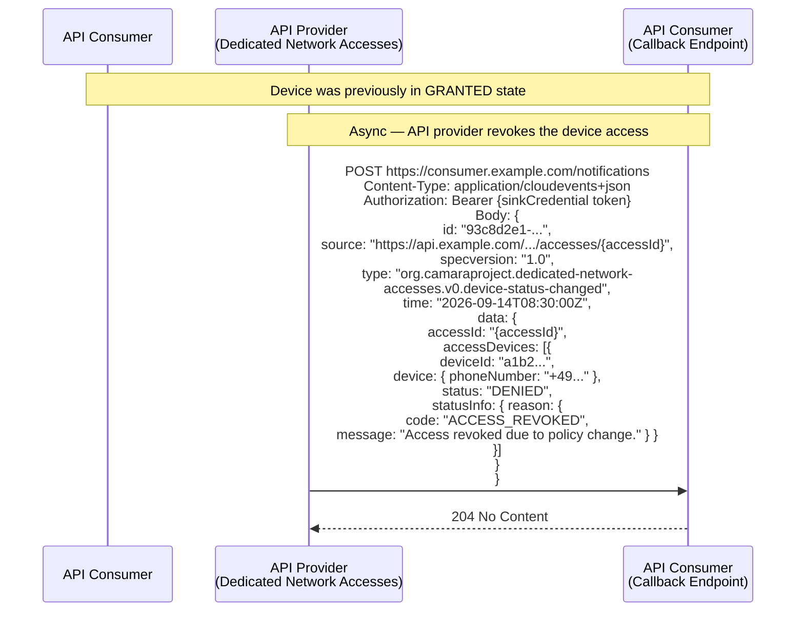
```mermaid
sequenceDiagram
    participant C as API Consumer
    participant API as API Provider<br/>(Dedicated Network Accesses)
    participant CB as API Consumer<br/>(Callback Endpoint)

    Note over C,CB: Device was previously in GRANTED state

    Note over API,CB: Async — API provider revokes the device access

    API->>CB: POST https://consumer.example.com/notifications<br/>Content-Type: application/cloudevents+json<br/>Authorization: Bearer {sinkCredential token}<br/>Body: {<br/>  id: "93c8d2e1-...",<br/>  source: "https://api.example.com/.../accesses/{accessId}",<br/>  specversion: "1.0",<br/>  type: "org.camaraproject.dedicated-network-<br/>    accesses.v0.device-status-changed",<br/>  time: "2026-09-14T08:30:00Z",<br/>  data: {<br/>    accessId: "{accessId}",<br/>    accessDevices: [{<br/>      deviceId: "a1b2...",<br/>      device: { phoneNumber: "+49..." },<br/>      status: "DENIED",<br/>      statusInfo: { reason: {<br/>        code: "ACCESS_REVOKED",<br/>        message: "Access revoked due to policy change." } }<br/>    }]<br/>  }<br/>}
    CB-->>API: 204 No Content
```

### (F2a) REQUESTED → GRANTED — 3-legged (B2B2C, no device object)

Same transition as F1a, but the device was added via a 3-legged token. The notification contains only the opaque `deviceId` — the `device` object is absent because the phone number must not be disclosed to the API consumer.

```mermaid
sequenceDiagram
    participant C as API Consumer
    participant API as API Provider<br/>(Dedicated Network Accesses)
    participant CB as API Consumer<br/>(Callback Endpoint)

    Note over C,CB: Device was previously added via 3-legged token<br/>and is in REQUESTED state

    Note over API,CB: Async — API provider grants the device

    API->>CB: POST https://consumer.example.com/notifications<br/>Content-Type: application/cloudevents+json<br/>Authorization: Bearer {sinkCredential token}<br/>Body: {<br/>  id: "a23f7b01-...",<br/>  source: "https://api.example.com/.../accesses/{accessId}",<br/>  specversion: "1.0",<br/>  type: "org.camaraproject.dedicated-network-<br/>    accesses.v0.device-status-changed",<br/>  time: "2026-09-14T09:00:05Z",<br/>  data: {<br/>    accessId: "{accessId}",<br/>    accessDevices: [{<br/>      deviceId: "x9y8...",<br/>      status: "GRANTED",<br/>      statusInfo: { reason: {<br/>        code: "REQUEST_APPROVED",<br/>        message: "Device access granted." } }<br/>    }]<br/>  }<br/>}
    Note right of CB: No device object —<br/>phone number not disclosed
    CB-->>API: 204 No Content
```

### (F2b) REQUESTED → DENIED — 3-legged (B2B2C, no device object)

Same transition as F1b, but the device was added via a 3-legged token. The `device` object is absent.

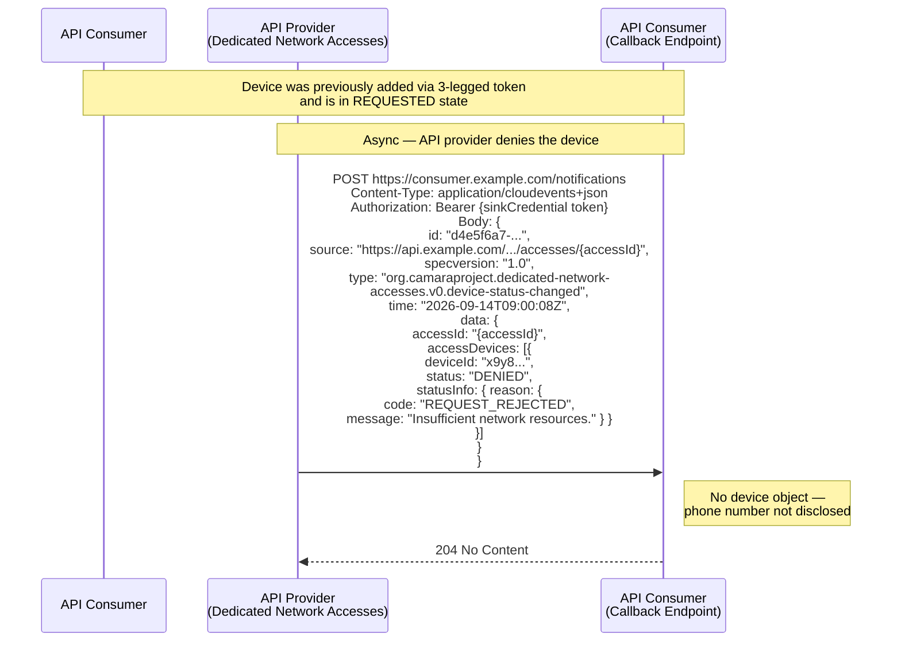
```mermaid
sequenceDiagram
    participant C as API Consumer
    participant API as API Provider<br/>(Dedicated Network Accesses)
    participant CB as API Consumer<br/>(Callback Endpoint)

    Note over C,CB: Device was previously added via 3-legged token<br/>and is in REQUESTED state

    Note over API,CB: Async — API provider denies the device

    API->>CB: POST https://consumer.example.com/notifications<br/>Content-Type: application/cloudevents+json<br/>Authorization: Bearer {sinkCredential token}<br/>Body: {<br/>  id: "d4e5f6a7-...",<br/>  source: "https://api.example.com/.../accesses/{accessId}",<br/>  specversion: "1.0",<br/>  type: "org.camaraproject.dedicated-network-<br/>    accesses.v0.device-status-changed",<br/>  time: "2026-09-14T09:00:08Z",<br/>  data: {<br/>    accessId: "{accessId}",<br/>    accessDevices: [{<br/>      deviceId: "x9y8...",<br/>      status: "DENIED",<br/>      statusInfo: { reason: {<br/>        code: "REQUEST_REJECTED",<br/>        message: "Insufficient network resources." } }<br/>    }]<br/>  }<br/>}
    Note right of CB: No device object —<br/>phone number not disclosed
    CB-->>API: 204 No Content
```

### (F2c) GRANTED → DENIED (revocation) — 3-legged (B2B2C, no device object)

Similar transition as F1c, but the device was originally added via a 3-legged token. Either the CSP or the device owner may revoke the permission. The `device` object is absent.

```mermaid
sequenceDiagram
    participant C as API Consumer
    participant API as API Provider<br/>(Dedicated Network Accesses)
    participant CB as API Consumer<br/>(Callback Endpoint)

    Note over C,CB: Device was previously added via 3-legged token<br/>and was in GRANTED state

    Note over API,CB: Async — API provider revokes the device access

    API->>CB: POST https://consumer.example.com/notifications<br/>Content-Type: application/cloudevents+json<br/>Authorization: Bearer {sinkCredential token}<br/>Body: {<br/>  id: "b8c9d0e1-...",<br/>  source: "https://api.example.com/.../accesses/{accessId}",<br/>  specversion: "1.0",<br/>  type: "org.camaraproject.dedicated-network-<br/>    accesses.v0.device-status-changed",<br/>  time: "2026-09-15T14:30:00Z",<br/>  data: {<br/>    accessId: "{accessId}",<br/>    accessDevices: [{<br/>      deviceId: "x9y8...",<br/>      status: "DENIED",<br/>      statusInfo: { reason: {<br/>        code: "ACCESS_REVOKED",<br/>        message: "Access revoked due to policy change." } }<br/>    }]<br/>  }<br/>}
    Note right of CB: No device object —<br/>phone number not disclosed
    CB-->>API: 204 No Content
```

## End-to-end example: 3-legged device add with notification and verification

This is not a separate operation — it combines B2 (3-legged device add), F2a (REQUESTED → GRANTED notification), and E (device list query) into a single end-to-end walkthrough. The `device` object is absent throughout — both in the add-device response and in the notification.

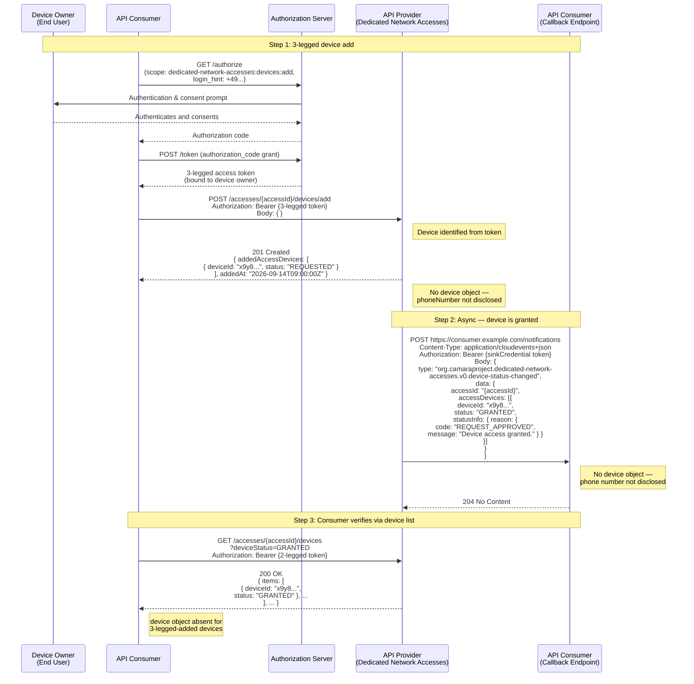
```mermaid
sequenceDiagram
    participant U as Device Owner<br/>(End User)
    participant C as API Consumer
    participant Auth as Authorization Server
    participant API as API Provider<br/>(Dedicated Network Accesses)
    participant CB as API Consumer<br/>(Callback Endpoint)

    Note over U,CB: Step 1: 3-legged device add

    C->>Auth: GET /authorize<br/>(scope: dedicated-network-accesses:devices:add,<br/> login_hint: +49...)
    Auth->>U: Authentication & consent prompt
    U-->>Auth: Authenticates and consents
    Auth-->>C: Authorization code

    C->>Auth: POST /token (authorization_code grant)
    Auth-->>C: 3-legged access token<br/>(bound to device owner)

    C->>API: POST /accesses/{accessId}/devices/add<br/>Authorization: Bearer {3-legged token}<br/>Body: { }
    Note right of API: Device identified from token
    API-->>C: 201 Created<br/>{ addedAccessDevices: [<br/>    { deviceId: "x9y8...", status: "REQUESTED" }<br/>  ], addedAt: "2026-09-14T09:00:00Z" }
    Note right of API: No device object —<br/>phoneNumber not disclosed

    Note over API,CB: Step 2: Async — device is granted

    API->>CB: POST https://consumer.example.com/notifications<br/>Content-Type: application/cloudevents+json<br/>Authorization: Bearer {sinkCredential token}<br/>Body: {<br/>  type: "org.camaraproject.dedicated-network-<br/>    accesses.v0.device-status-changed",<br/>  data: {<br/>    accessId: "{accessId}",<br/>    accessDevices: [{<br/>      deviceId: "x9y8...",<br/>      status: "GRANTED",<br/>      statusInfo: { reason: {<br/>        code: "REQUEST_APPROVED",<br/>        message: "Device access granted." } }<br/>    }]<br/>  }<br/>}
    Note right of CB: No device object —<br/>phone number not disclosed
    CB-->>API: 204 No Content

    Note over C,CB: Step 3: Consumer verifies via device list

    C->>API: GET /accesses/{accessId}/devices<br/>?deviceStatus=GRANTED<br/>Authorization: Bearer {2-legged token}
    API-->>C: 200 OK<br/>{ items: [<br/>    { deviceId: "x9y8...",<br/>      status: "GRANTED" }, ...<br/>  ], ... }
    Note right of C: device object absent for<br/>3-legged-added devices
```

## Summary

| Operation | Endpoint | Device addressed by identifier? | B2B | B2B2C |
|-----------|----------|--------------------------------|----------|----------|
| A1: Create access (no devices) | `POST /accesses` | No | 2-legged | 2-legged (3-legged → becomes A2b: device from token) |
| A2: Create access with device(s) | `POST /accesses` | Yes | 2-legged (`devices[]` 1-100) | 3-legged (device from token, no `devices` in body, single device) |
| B: Add device(s) to access | `POST .../devices/add` | Yes | 2-legged (`devices[]` 1-100) | 3-legged (device from token, no `devices` in body, single device only) |
| C: Delete a single device | `DELETE .../devices/{accessDeviceId}` | No (opaque accessDeviceId) | 2-legged | 2-legged (3-legged → error? TBD) |
| D: Remove devices from access | `POST .../devices/remove` | No (opaque accessDeviceIds) | 2-legged | 2-legged (3-legged → error? TBD) |
| E: List devices in access | `GET .../devices` | No (query filters only) | 2-legged (with `device` object) | 2-legged (no `device` object; 3-legged → error) |
| F: Notification (status change) | Callback to `sink` URL | No (server-initiated) | `device` object present | `device` object absent (only `deviceId`) |

## Use-Case: Gaming Demonstration at a Convention

A Gaming developer company wants to showcase a newly developed smartphone game at a gaming convention. Convention visitors are invited to install and test the game on their personal smartphones.

Because the game requires a stable and predictable network connection, the Gaming company rents dedicated connectivity resources from a public network provider for the duration of the event. These resources are intended to provide an appropriate network experience for visitors participating in the demonstration.

The Gaming company must then selectively authorize individual convention visitors to use the reserved network resources while they are taking part in the demonstration. The visitors use their own smartphones, and the Gaming company does not necessarily have a direct management relationship with either the devices or their subscribers.

In this scenario:

* The network provider owns and manages the connectivity resources.
* The Gaming company consumes the Dedicated Network APIs and acts as a gaming service provider to the visitors.
* The convention visitors are end users of the Gaming company’s service.
* The visitors use privately owned devices and subscriptions.
* Access to the dedicated network resources must be granted selectively and potentially revoked during the event. The Gaming company registers a notification sink so that it receives real-time status updates (e.g. REQUESTED → GRANTED or DENIED) and can provide immediate feedback to the visitor at the demo booth.
* Authorization is associated with individual visitor devices, identified via a 3-legged access token after the visitor authenticates and consents.
* The dedicated connectivity resources are available only for a defined event duration and location.

### Typical workflow

#### Before the event — Network reservation

Well before the convention, the Gaming company reserves a dedicated network via the Dedicated Network API (`POST /networks`). The request specifies:

* A **network profile** (`networkProfileId`) or **QoS profile** (`qosProfileName`) that matches the game’s connectivity requirements.
* A **service area** (`serviceAreaId`) covering the convention venue.
* A **service time** window (`serviceTime.start` / `serviceTime.end`) spanning the event duration.
* Optionally, a **notification sink** (`sink`, `sinkCredential`) to receive `NETWORK_STATUS_CHANGED` events.

The network is initially in `REQUESTED` state. Once the CSP commits the requested resources, the network transitions to `RESERVED` (the Gaming company is notified via the sink). At the configured service start time, the network transitions to `ACTIVATED` and is ready for device access. The Gaming company receives a `NETWORK_STATUS_CHANGED` notification for each transition.

Only after the network reaches `ACTIVATED` state can devices actually use the dedicated connectivity.

```mermaid
sequenceDiagram
    participant C as API Consumer<br/>(Gaming Company)
    participant Auth as Authorization Server
    participant NW as API Provider<br/>(Dedicated Network)
    participant CB as API Consumer<br/>(Callback Endpoint)

    Note over C,CB: Weeks/days before the event — reserve the network

    C->>Auth: POST /token (client_credentials grant)
    Auth-->>C: 2-legged access token

    C->>NW: POST /networks<br/>Authorization: Bearer {2-legged token}<br/>Body: {<br/>  networkProfileId: "...",<br/>  serviceAreaId: "...",<br/>  serviceTime: {<br/>    start: "2026-10-15T09:00:00Z",<br/>    end: "2026-10-17T18:00:00Z" },<br/>  name: "Gaming Convention 2026",<br/>  sink: "https://gaming.example.com/notifications",<br/>  sinkCredential: { ... } }
    NW-->>C: 201 Created<br/>{ id: networkId,<br/>  status: "REQUESTED", ... }

    Note over NW,CB: CSP evaluates and commits resources

    NW->>CB: NETWORK_STATUS_CHANGED<br/>{ networkId, status: "RESERVED" }
    CB-->>NW: 204 No Content

    Note over NW,CB: At service start time

    NW->>CB: NETWORK_STATUS_CHANGED<br/>{ networkId, status: "ACTIVATED" }
    CB-->>NW: 204 No Content

    Note over C,CB: Network is now ready for device access
```

#### Before the event / during the event — Creating accesses

Once the network is reserved (or activated), the Gaming company creates access resources to manage which visitor devices may use the dedicated network. There are two common patterns for how accesses are used:

**Case A — One access for the entire event:** The Gaming company creates a single empty access before the event starts (sequence **A1**), registering a notification sink. All visitor devices across the full event duration are added to this one access. This is simple to manage but results in a single large access resource.

**Case B — One access per gaming session:** The Gaming company creates a new empty access for each gaming session (e.g. one per hour or per demo round), each with its own notification sink. Visitor devices arriving during that session window are added to the corresponding access. When the session ends, the devices are removed in batch (sequence **D**) or left to expire. This pattern groups devices by time window, making it easier to manage turnover and track usage per session.

In both cases, the access is created with a 2-legged token (no device is addressed) and includes the `networkId` obtained from the network reservation step.

```mermaid
sequenceDiagram
    participant C as API Consumer<br/>(Gaming Company)
    participant Auth as Authorization Server
    participant API as API Provider<br/>(Dedicated Network Accesses)

    Note over C,API: Case A: One access for the entire event (before event starts)

    C->>Auth: POST /token (client_credentials grant)
    Auth-->>C: 2-legged access token

    C->>API: POST /accesses<br/>Authorization: Bearer {2-legged token}<br/>Body: { networkId: "{networkId}",<br/>  name: "Convention Day 1-3",<br/>  sink: "https://gaming.example.com/notifications",<br/>  sinkCredential: { ... } }
    API-->>C: 201 Created<br/>{ id: accessId-event, networkId,<br/>  stats: { totalDevices: 0, ... } }

    Note over C,API: Case B: One access per gaming session (repeated hourly)

    C->>API: POST /accesses<br/>Authorization: Bearer {2-legged token}<br/>Body: { networkId: "{networkId}",<br/>  name: "Session 10:00-11:00",<br/>  sink: "https://gaming.example.com/notifications",<br/>  sinkCredential: { ... } }
    API-->>C: 201 Created<br/>{ id: accessId-session1, networkId,<br/>  stats: { totalDevices: 0, ... } }
```

#### During the event — Visitor device lifecycle

1. **Visitor arrives at the demo booth:** The visitor authenticates and consents via the authorization code flow. Their device is added to the appropriate access (the single event-wide access in Case A, or the current session’s access in Case B) via a 3-legged token (sequence **B2**, repeated for each visitor).
2. **Async grant/deny:** The API provider evaluates the request and sends a `DEVICE_STATUS_CHANGED` notification to the Gaming company’s callback endpoint (sequences **F2a** / **F2b**).
3. **Status monitoring:** The Gaming company can query the device list to verify current device states (sequences **E1b** / **E2b**).
4. **Visitor leaves or session ends:** The Gaming company removes the visitor’s device individually (sequence **C**). In Case B, when a session ends, all remaining devices in that session’s access can be removed in batch (sequence **D**).
5. **Mid-event revocation:** If access is revoked by the network provider (e.g. network issue, policy change), the Gaming company is notified (sequence **F2c**).

### Applicable sequences

| Sequence | Applies? | Rationale |
|----------|----------|-----------|
| **A1** — Create access (no devices) | Yes | The Gaming company creates an empty access before the event using a 2-legged token. |
| **A2a** — Create access with devices (2-legged, B2B) | No | The Gaming company does not manage visitor devices — this is B2B2C. |
| **A2b** — Create access with device (3-legged, B2B2C) | Possible | Could apply if the first visitor’s consent triggers access creation, but A1 + B2 is more natural for a pre-planned event. |
| **B1** — Add devices (2-legged, B2B) | No | The Gaming company does not know or manage visitor phone numbers directly. |
| **B2** — Add device (3-legged, B2B2C) | **Yes — core flow** | Each visitor authenticates and consents; their device is added one at a time via a 3-legged token. |
| **C** — Delete a single device | Yes | A specific visitor’s device can be removed using the opaque `accessDeviceId`. Uses 2-legged token. |
| **D** — Remove multiple devices | Yes | Batch removal at the end of a demo session or at event close. Uses 2-legged token. |
| **E1a / E2a** — List devices (B2B) | No | This is a B2B2C scenario; the B2B listing variant (with phone numbers) does not apply. |
| **E1b / E2b** — List devices (B2B2C) | Yes | The Gaming company checks device status. The `device` object (phone number) is not disclosed. |
| **F1a / F1b / F1c** — Notifications (B2B) | No | B2B notification variants (with `device` object) do not apply to this B2B2C scenario. |
| **F2a** — REQUESTED → GRANTED (B2B2C) | Yes | The Gaming company is notified when a visitor’s device is granted access. |
| **F2b** — REQUESTED → DENIED (B2B2C) | Yes | The Gaming company is notified if a visitor’s device is denied. |
| **F2c** — GRANTED → DENIED / revocation (B2B2C) | Yes | The Gaming company is notified if access is revoked mid-event. |